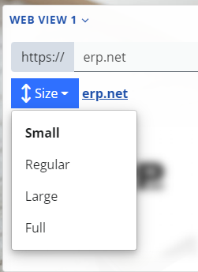

# Overview

The web view is a special type of app allowing you to show an external website or a service. 

Inside the @@webclient, as a part of its layout.

Besides being a standalone app, the web view can be plugged as a separate panel in any page, part of the @@webclient.

Here's an example of how it looks in the customers navigator,

Another one - this time in a sales order.

## Set up a web view

It's easy.

1. Navigate to the place where you want to show a web view. For this example we'll use the customers navigator.

2. Open the form's settings via its context menu and select the "Show/hide panels" option.

3. Now expand the "Widget Panels" section and you'll see 3 web view panels.

> [!NOTE]
> You can show up to 3 web view panels in each form.

For now, just toggle the visibility switch of the first one.

4. Your new web view panel will be added at the end of the page. Initially, the web view is not set and will look like this:

It's pretty obvious, isn't it? Just open the context menu and activate the "Edit mode":

5. Now the web view panel will be in edit mode. This means that you can set its URL address.

Type the external URL in the corresponding input and hit "Save".

Additionally, you can specify the vertical size of the panel.

All sizes are relative to the viewport- the visible area of the web page.

- Small = 30% of the page height
- Regular = 50%
- Large = 60%
- Full = 100% - i.e. the whole page.

6. Done. Your web view is set.

## Remarks

Internally, the web view presents its content via an [&lt;iframe/&gt;](https://www.w3schools.com/html/html_iframe.asp).

This means that there're some limitations:

- The website (or service) you want to display in a web view must allow this.

This is controlled by the `X-Frame-Options` HTTP response header, and if set to `DENY` or `SAMEORIGIN`, the web view won't be able to visualize it.

https://developer.mozilla.org/en-US/docs/Web/HTTP/Headers/X-Frame-Options

- The website (or service) requires authentication, managed by authentication cookies which are restricted to a first-party or same-site context.

This means that the external website should explictly set that the auth cookies will be sent in cross-site requests.

https://developer.mozilla.org/en-US/docs/Web/HTTP/Headers/Set-Cookie/SameSite

- If this is an external application, using @@erpnet Identity Site for authentication, the Id site must be the same one, as for @@webclient.

The reason is simple. Actually, this is the same as the previous limitation. @@erpnet Identity Site's cookies are restricted to the `same-site` context.

## String interpolation

Above, it was explained how you can specify the URL for the web view.

But there's one detail- this isn't just an URL, it's an interpolated string.

If you paid attention earlier when we were setting up the URL for the web view, there was a button in the corresponding input. Here it is:

This will open the interpolated string builder, so you can easily set up your interpolated string.