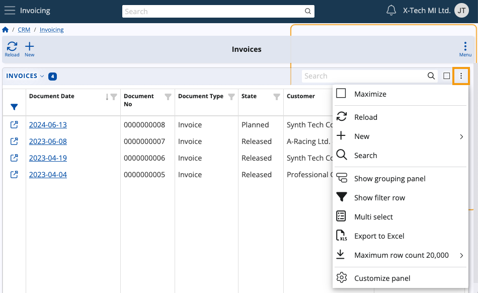

# Navigator features

There are several features and behaviors that are common for all ERP.net Web Client navigators.

## Default sorting

If you haven't customized the view of a document navigator in any way, or if you have reset your current view's settings to default, they will be sorted by **Document Date** in a descending order.

This is done for convenience, as it allows you to see the documents which were most recently created first.

## Accessing records

In most navigators, you can access a document or a record through the value of its **first** column, regardless of which column that is.

Values displayed in the rows of that column are accessible through **hyperlinks** leading exactly to the document they represent.

> [!NOTE]
> Certain navigators don't support opening links and therefore don't have this feature enabled.

You can alternatively access the document form of a record:

1. By clicking on it, then expanding its **Details** panel and finally clicking on the **Open** button
2. By clicking on its **icon** positioned in the **System column** at the far-left.

> [!NOTE]
> The **System column** always contains a quick-access button for the respective record and its position cannot be modified

## Navigator menu

Each navigator features its own dedicated **Menu** through which you can perform the following:

* Determine the security type of each navigator record by configuring **access permissions**
* Build and apply **advanced filters**
* Use ERP.net's dedicated **AI Asssistant** (upcoming)
* Take advantage of **side panels** that reveal additional data and attachments for each selected document
* Use **[functional panels](./how-to/functional-panels/index.md)** to speed up the process of filling out a document
* View **Hierarchy** references and apply filters based on them
* Expand **detail panels** to see information relevant for each selected record of the navigator (e.g. its Document Lines)
* Create **tiles** to save and later easily access a specific navigator view
* **[Customize](https://docs.erp.net/webclient/introduction/how-to/ui-customization/access-to-views.html)** the navigator form by enabling, disabling, reordering and renaming its panels and widgets.

### Hierarchy 

The Hierarchy feature works with navigators having one or more **references** to hierarchical nomenclatures.

When there are multiple references, it reveals **side panels** representing all available hierarchies together with their comprising elements.

Each hierarchy uses a tree-like structure to organize its elements, starting with the hierarchy itself and going further into its elements.

For instance, clicking on the **Adjusted Document** hierarchy in **Invoices** will expand a side panel displaying all adjusted documents.

You can **click** any element of a hierarchy to apply an instant **filter** on the contents of the respective navigator. 

In the case of Adjusted Document, clicking on an element of that hierarchy will filter the Invoices page to show only invoices for which this particular adjusted document has been created.

> [!NOTE]
> 
> Only one filter can be applied through **Hierarchy** at a time.

Certain hierarchies like **Product Group** have their elements organized into **sub-elements**.

In that case, you can filter the respective navigator both by the more global element and by its more specific sub-elements.

If there is **only one** reference to a hierarchical nomenclature in a navigator, the **Hierachy** button will be replaced by it. 

> [!NOTE]
> The screenshots taken for Hierarchy are from v25 of the Web Client.

## Panel menu

Panels and widgets enabled in a navigator have a separate **Menu button** accessible at their top-right corners.

It features the ability to:

* **Maximize** the panel to take up the entire screen
* **Reload** the panel to reflect the most up-to-date information
* Quickly create a **new** record of one or more respective types
* **Search** the contents of the respective panel
* Take advantage of handy advanced features like the **[Grouping panel](https://docs.erp.net/webclient/introduction/my-apps/documents.html#show-grouping-panel)** and **[Filter row](https://docs.erp.net/webclient/introduction/how-to/filtering-expressions.html)**
* Select **multiple** records from the panel
* Create a **.xlsx file** containing all records of the panel
* Limit the **row counts** of the panel to a specific number
* **[Customize](https://docs.erp.net/webclient/introduction/how-to/ui-customization/customize-fields.html)** the panel by enabling, disabling, reordering and renaming its columns.

### Multi select

Whenever you select multiple records using the **Multi select** feature, a new **Selected** count button will appear on the navigator's ribbon.

It allows you to **export** the selected records as .xlsx files

### Group by column headers

With the help of the **[Show grouping panel](https://docs.erp.net/webclient/introduction/my-apps/documents.html#show-grouping-panel)**, you can also group a navigator's records based on one or more column headers.

Such groups can be used to organize records by type, state, the month they were created on, etc.

## Row context menu

If you **right-click** on a particular row, you will expand a dropdown menu with one or more of the following options:

* **Open** the row's associated record
* Apply an **advanced filter** affecting the entire panel, using this particular row as source (e.g. documment currency)
* Access the **form definition** of the row (only for fields that can be defined).

## Column context menu

If you **right-click** on a particular column, you will expand a dropdown menu with the following options:

* **Sort** the column's contents by ascending or descending order
* **Clear** the sorting, restoring the column view to default
* **Group** the records of the column by specific criteria based on the type of the column (word-based, time-based, etc.)
* **[Summarize](https://docs.erp.net/webclient/introduction/my-apps/documents.html#summary)** columns using functions like Summary and Distinct
* Restore the column's **default width**
* **Hide** the column from view (can be re-enabled through the Panel customization Menu)

### Group by intervals

Depending on the type of a column (e.g. Date, Number, Document Type), you can perform more specific grouping operations.

This is achieved through **intervals** such as character counts (for text-based columns) or time periods (for time-based columns).

**Example:**

We can apply a rule where records will be grouped by the **[business week](https://docs.erp.net/tech/modules/my/calendar.html#business-week-number)** indicated in their **Document Date** column.

As a result, the entire panel will be divided into "BW" groups that include records created in the respective business week.

Attempting to group records by **Document No** will offer different interval options.

> [!TIP]
> If you right-click on a column header with an interval filter applied, you can **expand** or **collapse** all groups at once.

### Sorting summarized groups

If a **[Summary](https://docs.erp.net/webclient/introduction/my-apps/documents.html#summary)** function is applied on a column, you can use it to **sort** existing groups.

Groups can be sorted based on their own column or by columns which have summary functions applied.

> [!NOTE]
> The screenshots for this article are from v24 and v26 of the Web Client.
