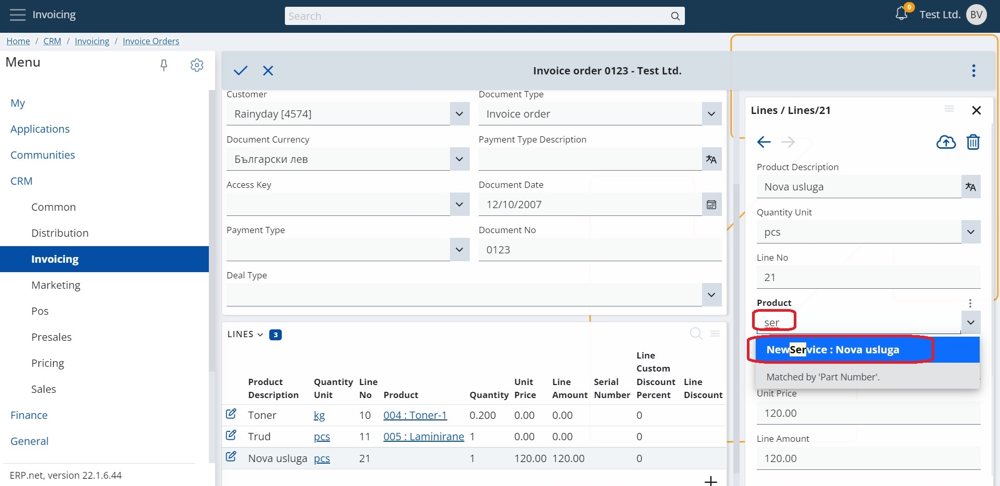

# How to search in drop down lists

### DefaultSearchMembers

Each repository defines its own _DefaultSearchMembers_ - a collection of _DataMembers_ which make **searching** possible. 

The default search members can be found within the "Default Visualization" section of every entity. Take a look at [products](https://docs.erp.net/model/entities/General.Products.Products.html). 

### DisplayTextFormat

Searching can also be accomplished with the help of fields that comprise the _DisplayTextFormat_. However, these fields are prioritized after the _DefaultSearchMembers_. Searching is initiated only if there isn't any match with the fields before them. 

This applies to **dropdown lists** as well.

### Results

By default, _DefaultSearchMembers_ are entities which have a code and name return the code and the name as part of the search results. 

Searching in dropdown lists and domain API returns only results which are based on the first field for which there are matches. Subsequent searches are not undertaken.

If a search operation finds an exact match, the value is filled automatically in the corresponding field. 

## Example 

1. Open the Invoicing module from the web client.
 
2. Within the lines, in the _Product_ field, type "ser".

3. Different results respecting the search criteria will be listed.

