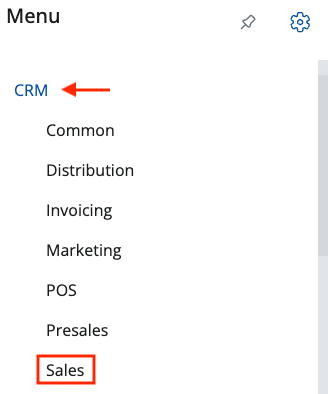
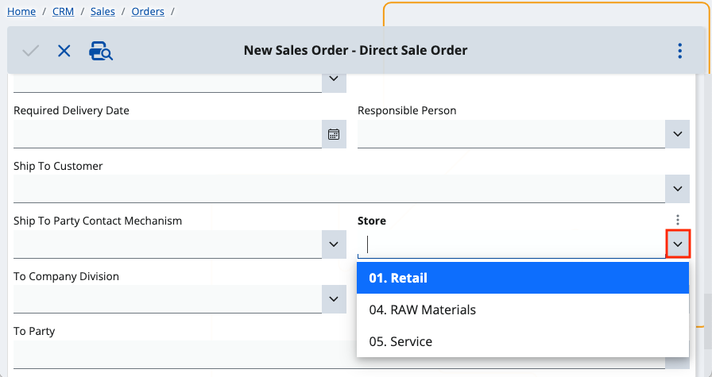
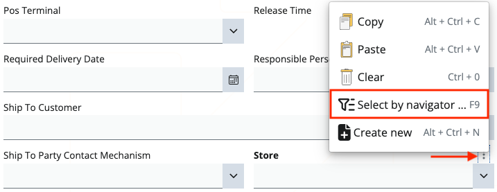
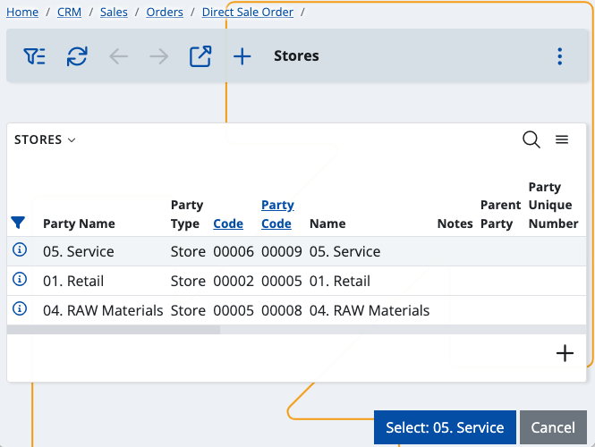
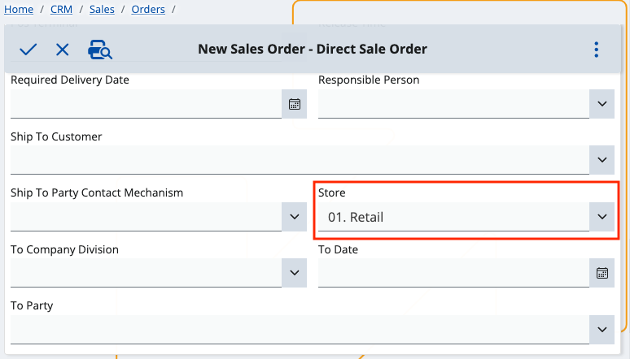

# How to use the Select by navigator feature

You can be more flexible and knowledgeable about the choices you need to make when creating different documents. 

For example, if you're filling out fields which use standard dropdown menus for making selections, you have the option to open these menus in a separate space.

This feature is known as **Select by navigator**. It allows you to complete a field by reviewing details about its associated options first and then making the final selection.

Once you confirm your choice, it will be **automatically** applied on the main document creation form. 

## Example use-case

1. To begin the process, choose a section from the menu (e.g. **CRM**) and then a subsection (e.g. **Sales**).

2. We want to create a **direct sale order**. 

3. On the respective form, you can see multiple fields which can be filled with the help of dropdown menus.

To access the **Select by navigator** option and the respective information which comes with it, click the **downward chevron** button.

4. A vertical three-point button will appear right above the chevron button. 

By clicking on it, you expand a menu from which you need to choose **Select by navigator**.

This takes you to the page of the dropdown menu where you can see all of the field's available options. 

The navigator responsible for containing it is opened in **Select mode** and allows for a record selection.

5. The **Select** button text is dynamic and will change each time you select an option (line).

 
After selecting and confirming your choice, you will return to the original document form.

The option you've chosen will be reflected in the respective dropdown field.

