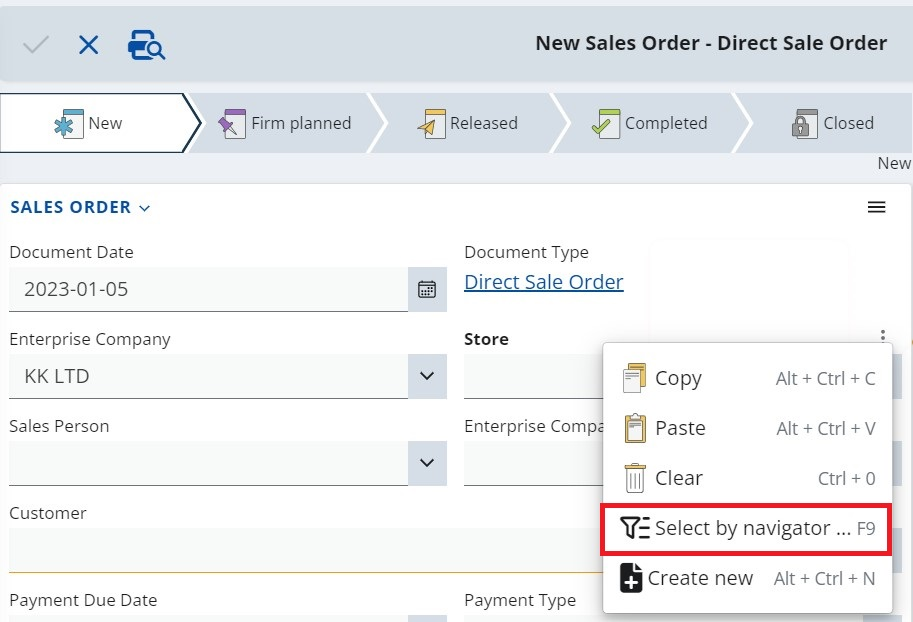
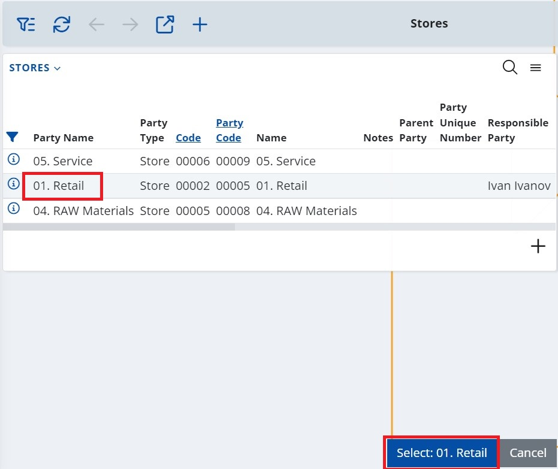
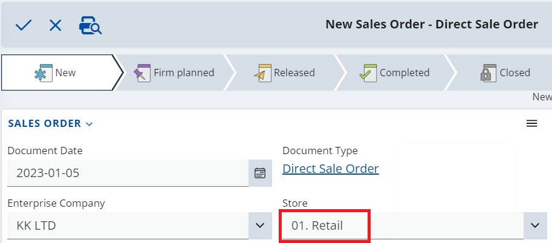

# How to use the Select by navigator option

The **Select by navigator** option allows you to easily select a value for a certain field, when creating or editing a document.  

The option is available for the fields whose values are records from another entity. It opens the entity navigator where you can use the navigator’s filters to find the desired value and select it into the field. 

## Example: 

1. Create new Sales Order

2. Click into the Store field and a three-point button of the context menu will appear. 

3. By clicking on it, you expand a menu from which you can choose Select by navigator option.

4. The respective navigator for the field type opens up in Select mode and allows a record selection.  

The Select button text is dynamic and changes each time a different line gets marked.

5. Click the Select button. The system returns to the main form where the selected record’s value filled into the field.

 
