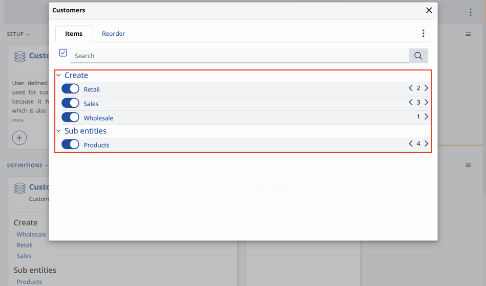
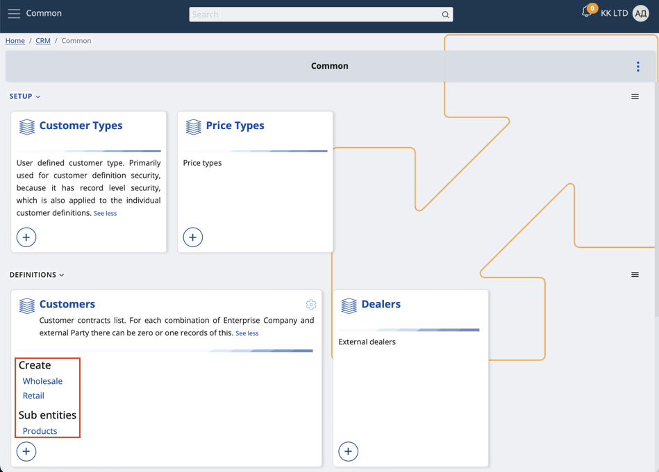
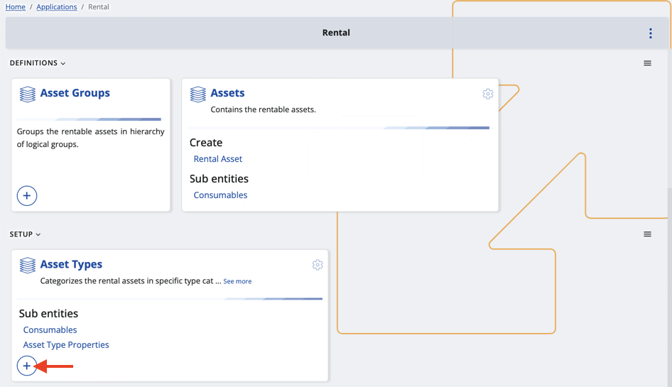
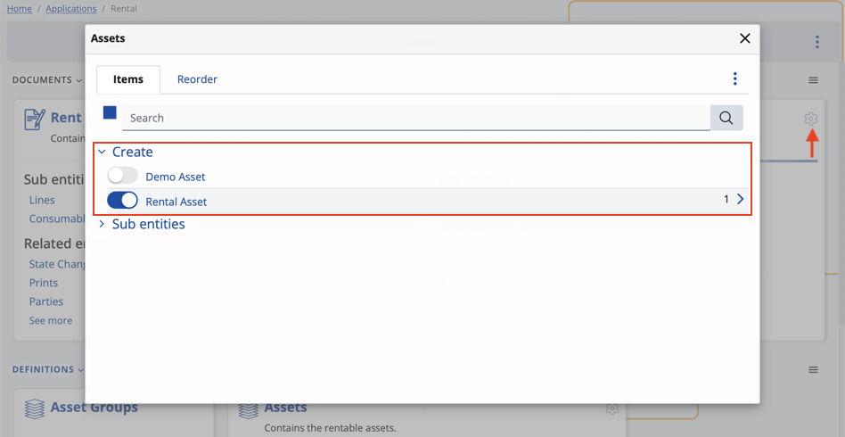
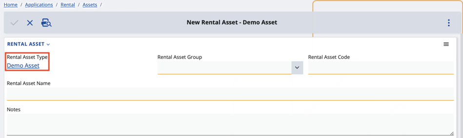

# How to separate views by object category

**Object categories (OCs)** can be accessed from within the panels of bigger entities such as Customer, Asset and Document.

You can integrate them into different creation forms and make the views of these forms **distinguishable** from one another.

### Example

Some forms prioritise certain fields over others. 

When issuing a return of a product, for instance, you may want to request the original price but not the birth date of a client.

Depending on its use-case, an object category will represent one or more **types** - Customer Type, Asset Type and Document Type.

If you enable an OC for a panel, it will be possible to start creating a document or an entity from there with that OC **already** selected for it.

#### Here's a list of data types and supported object categories:

Applications / Asset Мanagement: Managed Asset - Managed Asset Type

Applications  / Rental: Asset - Asset Type

Applications / Service: Service Object - Service Object Type

CRM / Common: Customer - Customer Type

Finance / Assets: Asset - Asset Category

General / Common: Parties - Party Type (exception, because it is an Entity Type specifier)

General / Common: Document - Document Type (exception, because documents are also separated by leaf entity type)

General / Products: Products - Product Type

Logistics / Common: Logistic Units - Logistic Unit Type

Logistics / Procurement: Supplier - Supplier Type

## Process

1. You need to create or have at least one object category in advance.   Not all entities have OCs, so you’ll need to add them manually by clicking the **circular plus button** found on the respective panel.

2. Enable the new OC for the respective panel by clicking the **settings button** at the top-right corner.   For most document types, it's possible to reveal or hide existing object categories for the **Create** and other sections.

 
3. Click the object category visualized on your panel.   This will take you to the creation form of the document or entity where the OC is already applied.   Keep in mind that the field will be **read-only** and unable to be changed.

4. Customize the view of the form through the three-dot **Show/hide panels** button. This allows you to enable or disable the available fields.   If you click **Save as default view**, the form's new view will be applied and associated with a particular object category.   To bring back the standard settings, click **Restore default settings**. 
 

