# Meet in @@webclient 

The Meet feature (Video Conferencing) enables real-time video conferencing directly within the system, allowing users to initiate and participate in online meetings without leaving their working context. It is designed to support immediate communication and collaboration across teams by integrating video meetings into the environments where work is already managed.

Our company has chosen [jaas.8x8.vc](https://jaas.8x8.vc/#/) platform for this feature.

Meet is available within Groups and can also be initiated from business-related records, including Cases, Activities, Service Activities and Marketing Activities.

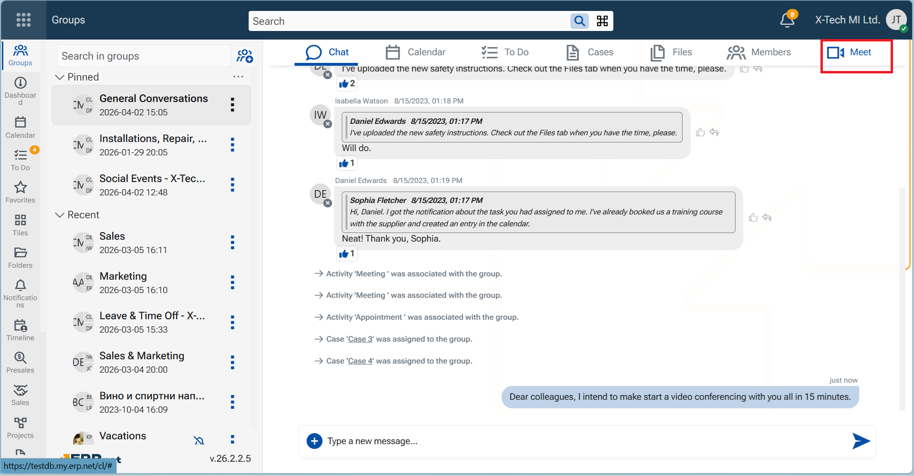

This allows discussions to be started in direct relation to ongoing work, reducing the need to switch between tools and ensuring that communication remains context-aware.

The feature provides a unified video conferencing experience with the following capabilities:

- **Instant meeting initiation**  
  Any member of a group or participant in a supported record can start a meeting without prior scheduling.

- **Integrated meeting environment**  
  Meetings open in a dedicated video conferencing page and are connected to system notifications and chat.

- **Participation through chat notifications**  
  When a meeting starts, a system message is posted in the related chat, allowing participants to join directly.
  
- **Audio and video readiness**  
  Camera and microphone are available by default for all participants, enabling immediate interaction.

- **Recording functionality**  
  Meetings can be recorded, with recordings stored and made available for download after the session.
  
- **Automatic file management** 
  Recordings are saved in the corresponding Files section, with system-generated names based on date and time.

## Meet platform

ERP.net has implemented Jitsi As A Service [jaas.8x8.vc](https://jaas.8x8.vc/#/) platform for this feature. The meeting is held within a new browser window. At its end, the browser tab remains until closed by hand.

## Getting Started

### Start a meeting from a Group

_You are the initiating participant_

1. From within the Group, navigate to tab **Meet** and click on. it  
An informative page opens.
   
2. Click on the button **"Start Meeting**". 
A lobby page opens. It contains all group members.

3. Select the participating members. 
The host member - you - is preselected and cannot be unchecked.

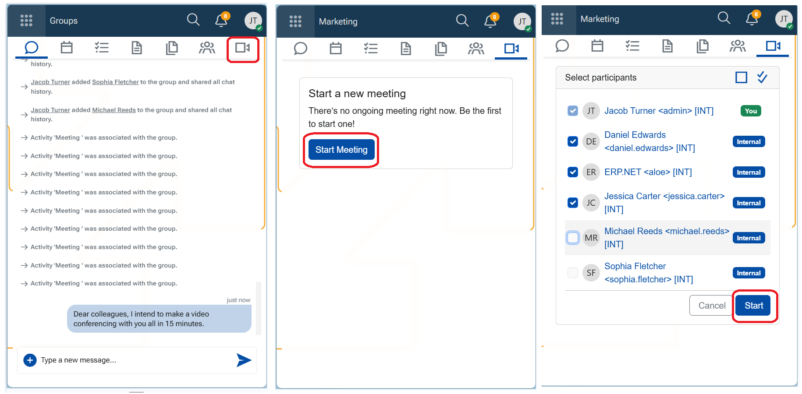

4. Click **"Start"**. 
The video conferencing page opens and the meeting starts immediately.
   
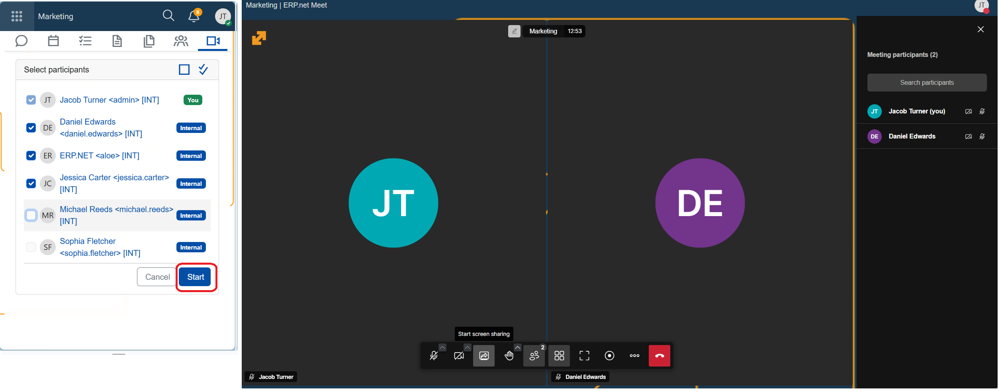

The **video conferencing page** provides the active meeting environment where participants communicate in real time. It includes standard meeting controls, such as:

- Audio and video management
- Screen or content sharing
- Environment and layout settings
- Meeting recording controls

These controls allow participants to interact, present, and manage the meeting as it progresses.

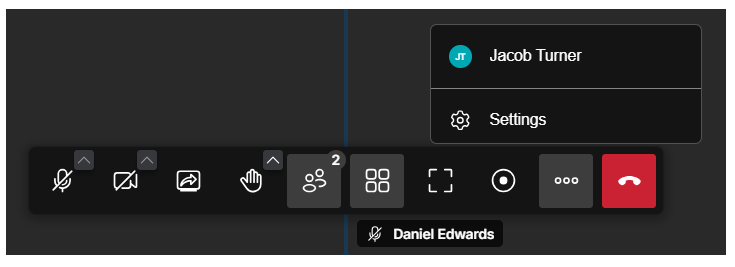
   
> [!NOTE]
>  When a meeting is started, the system **notifies** participants through multiple channels: 
>
> 🔔 A system comment is posted in the group's chat: "_The meeting has started. Click **Join meeting** to participate._", where "Join meeting" is a link. 
> 🔔 A notification appears in the **Notifications** panel (Bell icon) and is marked as unread. 
> 🔔 A red toaster pops up in the bottom-right corner of the screen (for 10s).   
> 🔔 A melody is played. It will stop if you click on the red toaster, or after 10 seconds.

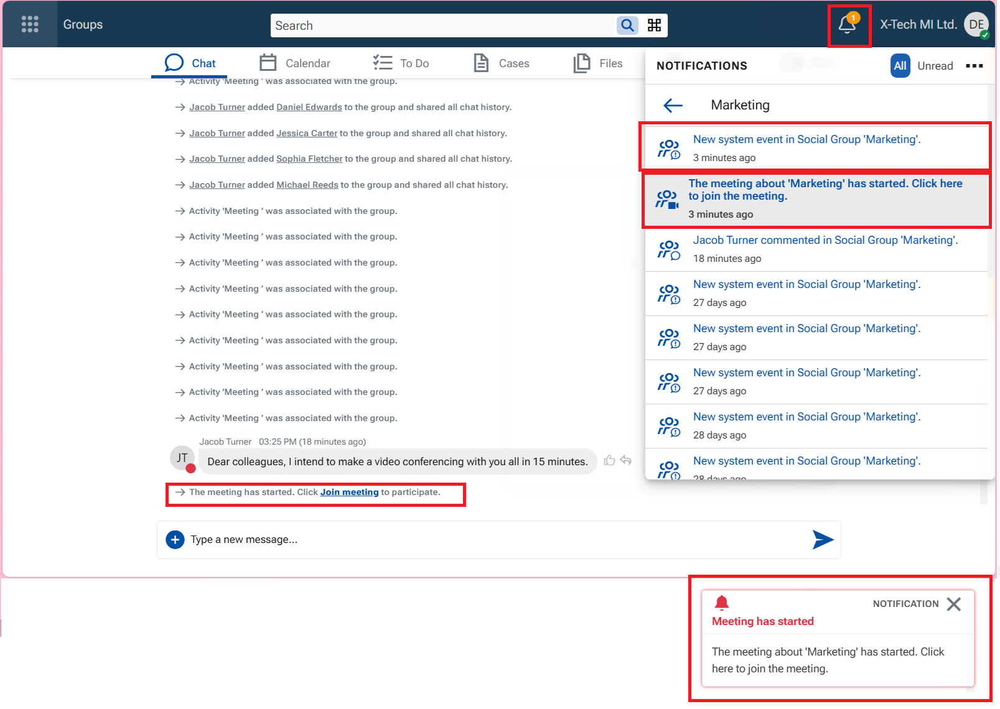

### Join a meeting from a Group

_You are simply a participant_

**Variant A** - Join an ongoing meeting using the entry points in the NOTE 
1. Click on the red toaster, or the notification, or the link in the system comment - the system takes you to the lobby page.
2. Click **Join meeting** to enter the ongoing meeting.

**Variant B** - Join an ongoing meeting from the Group  
If you have missed the notifications you can:<be>
1. Go to tab Meet
2. Click **Join meeting** to enter the ongoing meeting. 
   The conferencing page opens, and you can see what is being shared and participate.

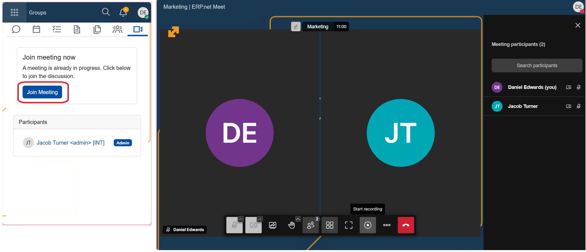

When participants are in meeting, their user state changes to "Busy".

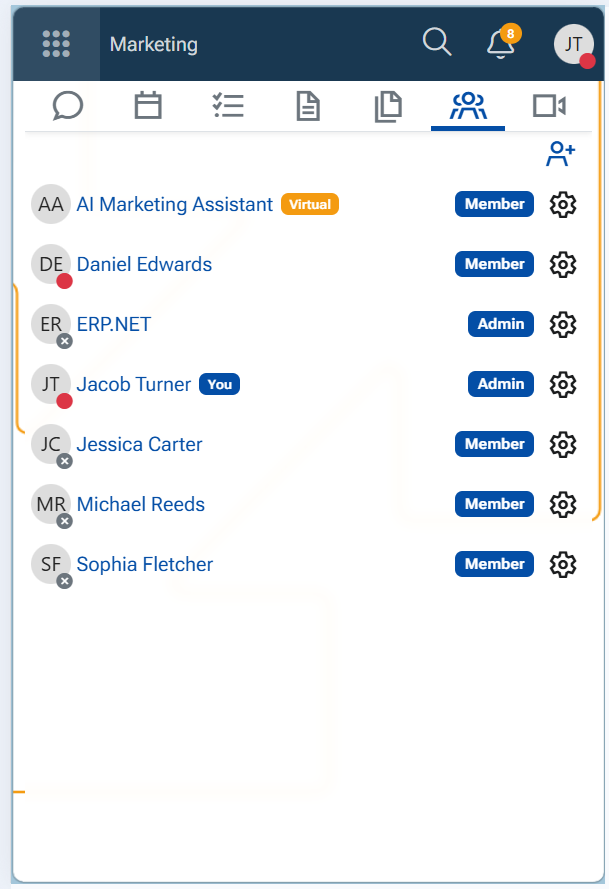

### Start a meeting from a record

You can initiate a meeting from the following records:
- Case  
- Activity  
- Service Activity  
- Marketing Activity  

1. Open the desired record.  
2. Open the main menu (three vertical dots in the top-right corner of the form).  
3. Select option **Meet**.
   
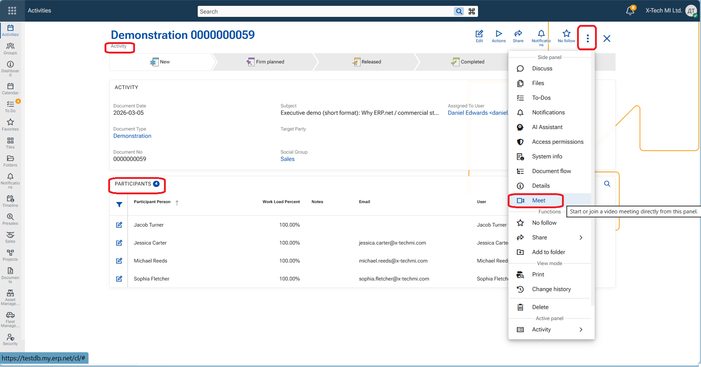  
   
A side panel opens with the Meet initial page - _Start a new meeting_.

4. Click **Start meeting**.  
The meeting lobby page opens and displays the list of potential participants.  
5. Select/deselect participants.  
6. Click **Start**.  
The video conferencing page opens and the meeting starts.
   
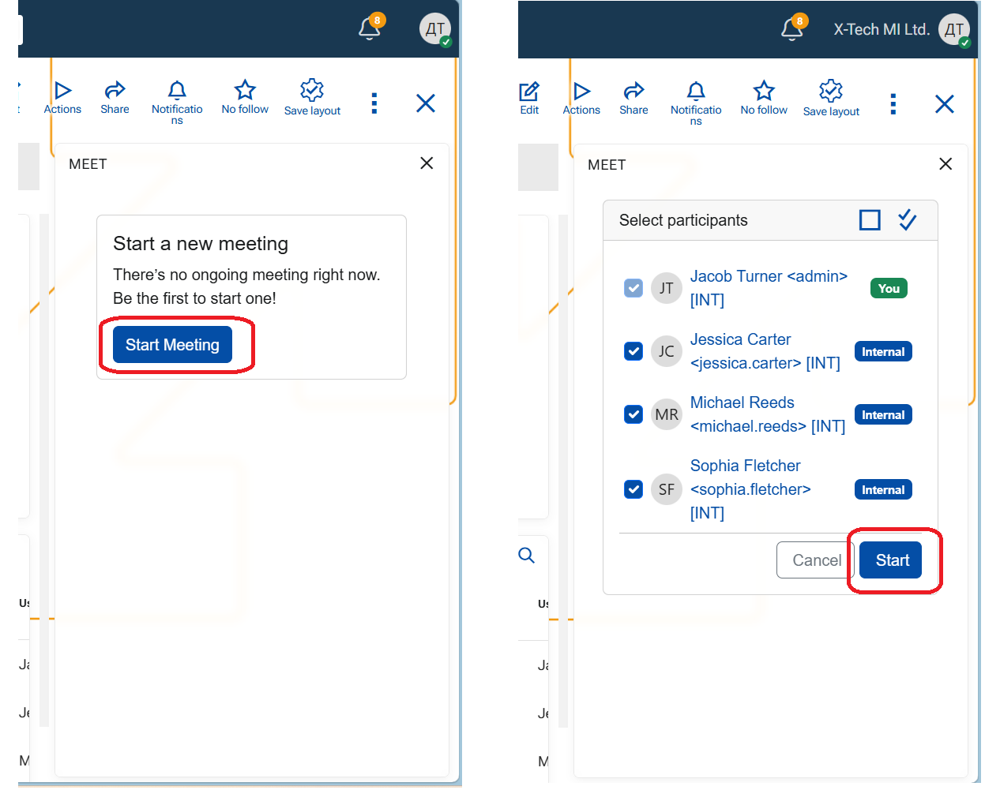

### Join a meeting from a record

When a meeting is started, the system notifies participants through the mentioned channels (see Note above). The system message is posted in the related Discuss panel of the record. 

From within the record (Case, Activity, Service Activity, or Marketing Activity)

1. Join the meeting using any of the available entry points:
   - Click **Join meeting** in the chat message.  
   - Click on the notification from the **Notifications** panel. 
   - Click the red toaster.   
2. The meeting lobby page opens.  
3. Click **Join meeting** to enter the ongoing meeting.

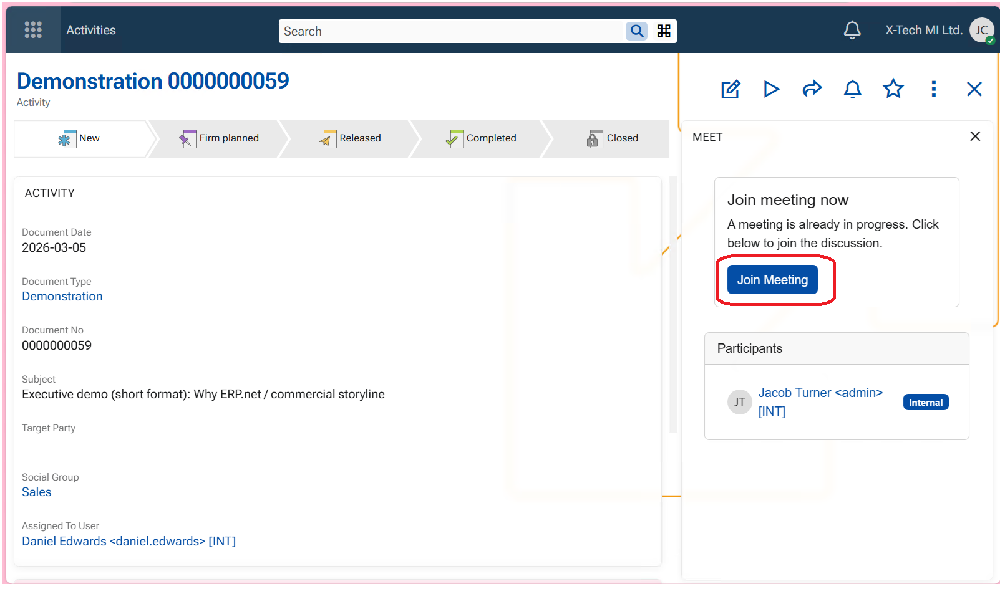

*For rules about Participants, see Configuration.

### Stop a meeting

Participants can leave the meeting at any time by pressing the red "End call" button. If only two participants are in the meeting, it ends when either of them leaves.

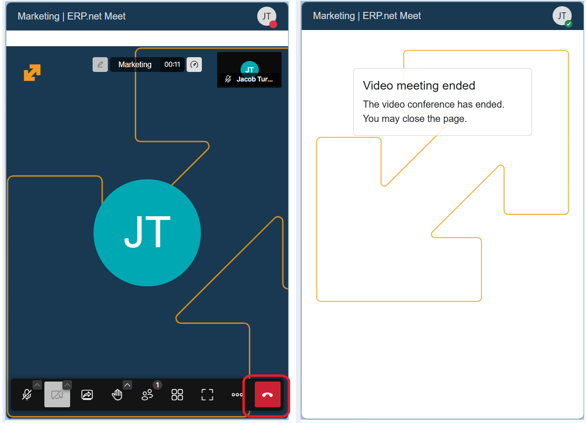

### Record a meeting

1. In the video conferencing page, locate the recording control - a round button - and click on it. 
   A confirmation pop-up appears. 
2. Click **Start recording**.  
The system begins recording the meeting. 
💡 Two  toasters notify that a Recording is being prepared and a Link is generated. 
💡 A voice confirms that "Recording is on". 

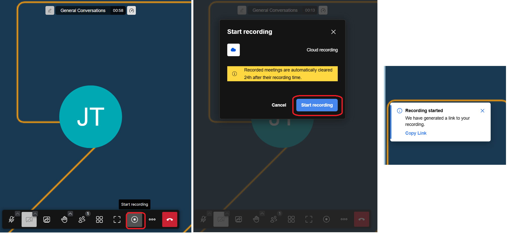

To stop recording, click **Stop recording** - a square button. Confirm.  
💡 A voice confirms that "Recording has stopped". 

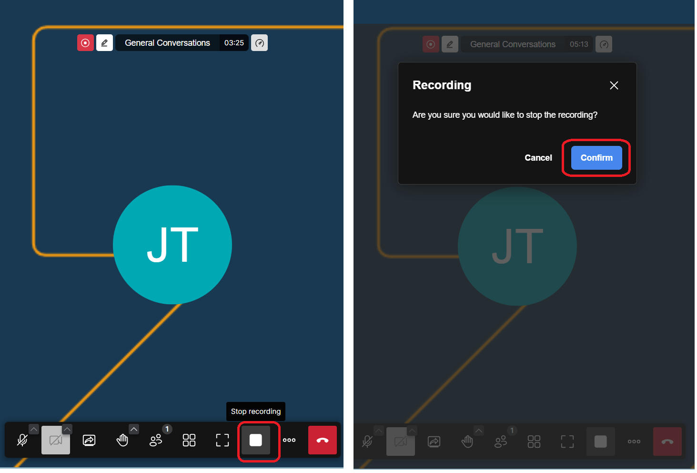

The recording generates as a file, that is actually a URL link. It is stored in tab Files of the Group or the record. The file name includes the exact date and time of the meeting.A system comment announces the upload of the File too.

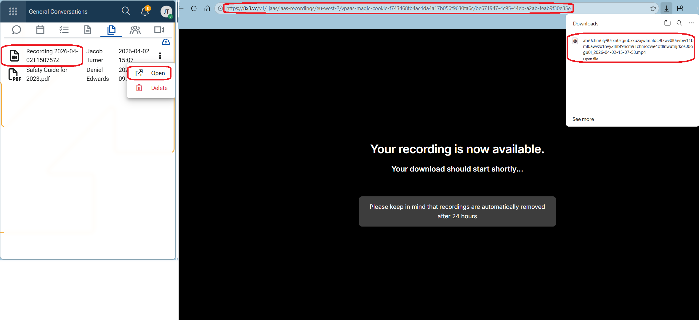

> [!WARNING]
> Recording is available for download for a limited time only - 24h. After this period it is automatically deleted and can no longer be accessed.
> Make sure to download it immediately after the meeting ends!

## Configuration

The availability of video conferencing features is **License-based**:

- **X19 – Basic**
  - Meetings are available for internal users only  
  - Recording is not available  

- **X20 – Advanced**
  - Meetings are available for both internal and external users  
  - Recording is available and can be initiated by internal users  

> [!IMPORTANT]
> Potential **Participants** in meetings are determined based on the context of the record.
> - A meeting from a Case calls participants who are Tagged at least, or have set higher follow level (Following, Favorite) for the record. 
> - A meeting from an Activity/Service Activity/Marketing Activity needs users explicitly listed as participants. 
> - A meeting from a Group needs only its Group Members.

