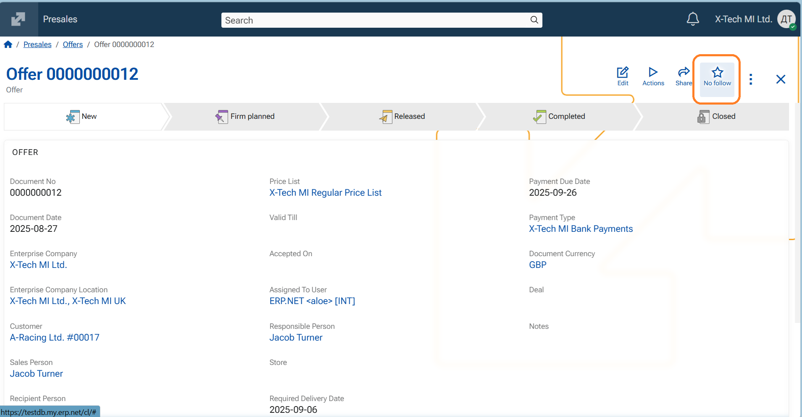

# Overview of Social Follows 

Social follows is a key aspect in Social ERP.They allow users to express interest in business objects and stay informed when something happens in their context.

Originally, following an object was treated as a single action: you either followed it or you did not. Following was implicitly understood as “this object matters to me” and was closely tied to concepts such as **favorites, notifications**, and visual indicators in the UI. As the system evolved, this simple model became limiting. 
Following is no longer a simple “follow/unfollow” state. Instead, each follow has a **Follow level** that indicates *why* you follow an object and *how important* it is to you.

## Why the model evolved

In practice, not all follows are the same.

Some follows exist because:
- the system automatically involved the user (mentions, assignments)
- the user explicitly chose to keep track of an object
- the object is truly important and needs quick access and higher visibility

Treating all these cases identically led to:
- important objects being mixed with incidental ones
- limited control over visibility and prioritization
- a rigid notification model that could not scale

Follow levels were introduced to address this.

## Follow levels as a unifying concept

Follow levels extend the original idea of following by adding intent and importance.

Instead of answering only "is this object followed?", the system can now also answer:
- why the object is followed
- how important it is to the user

This enables:
- automatic follows (e.g. mentions) without overstating importance
- explicit follows without cluttering high-priority views
- Favorites as a deliberate, high-interest choice

## Follow levels

- **Tagged**  
  You are following the object automatically, typically because you were mentioned or assigned. 

- **Following**  
  You explicitly chose to follow the object.

- **Favorite**  
  You explicitly marked the object as a favorite. Favorites are shown in the **Favorites** app.
  
There is no zero level for unfollowed objects and such objects are indicated by a **No Follow** icon.

## [Favorites](../my-apps/favorites/index.md) in the new model

In the previous model, following an object automatically implied:
- receiving notifications
- the object appearing in Favorites-related views

In the new model:
- Favorites are an explicit decision, represented by the highest follow level
- not all follows result in a Favorite
- automatic follows no longer create Favorites by default

This separation makes Favorites meaningful, limited, and intentional.

## Getting Started

This section describes the shortest path to start using follow levels in the Web Client.

### Change follow level from the form header

1. Open the object you want to follow (e.g. a document, a case, etc.).
2. Use the **star (follow) button** in the form header.
3. Each click moves to the next state in a cycle:

   - **Not followed** → **Following**
   - **Tagged** → **Following**
   - **Following** → **Favorite**
   - **Favorite** → **Not followed** (unfollow)

Expected result:
- If you set an object to **Favorite**, it becomes available in the **Favorites** app.

### Change follow level from the context menu

The context menu follow action uses the **same behavior as the form header button** (the same click-cycle logic).

### Quick follow/unfollow actions 

In addition to the standard follow-level click cycle, you can use the following shortcuts on the **Follow (star) icon** to immediately change the follow states (skip the cycle): 

- Add to Favorites - *Ctrl + Click* on the star icon → sets the object to **Favorite** (adds it to [My Favorites](../my-apps/favorites/index.md)

- Unfollow immediately - *Shift + Click* on the star icon → **Unfollow** (removes the follow record and if Favorite - removes it from My Favorites).

## Concepts
This section explains the strategy behind the introduction of Follow levels and its impact on other instruments in Web Client

**Long-term purpose**

The introduction of follow levels provides a stable foundation for:
- clearer user intent
- better prioritization of information
- consistent behavior across clients
- future extensions such as smarter notifications and filtering

Rather than adding more special cases, follow levels allow the system to grow while remaining understandable — for users and for developers alike.

**What was intentionally removed from the old model**

The following behaviors no longer apply and were intentionally redesigned:
- Following an object does not automatically make it a Favorite
- Automatic follows do not create Favorites
- Favorites are not a side effect of notifications
- Visual tiles are no longer created for every follow

This change is deliberate and aligns the system with clearer user intent and scalable behavior.

**What is shown in Favorites**

 - The Favorites app lists only objects with Follow level = Favorite.
 - A user can have **up to 50 favorite objects**. If you reach the limit, you must remove an existing favorite before adding a new one.

**Automatic follows**

When the system creates a follow automatically (e.g. due to a mention/assignment), the follow level is **Tagged**.

**Chat groups**

- Group membership sets automatic follow level **Tagged** for the Group.
- **Mute/Unmute** uses follow level **Tagged**.

**AI Assistant panel**

Creating a new conversation creates a follow with level **Tagged** for the conversation.

**Notifications**

Follow level is applied per notification class, not as a global “enable/disable notifications” switch:
- Comment/Chat classes are always created for TAGGED/FOLLOW/FAVORITE,
- Record Update classes are created only when Follow level ≥ FOLLOW,
- and Implicit document-state notifications (NT_DOC_STATE_IMPLICIT) are created only when Follow level = FAVORITE. For NT_DOC_STATE_IMPLICIT the condition is evaluated as an **OR across all relevant follows** for the document (at least one relevant Favorite enables it), and the system must deduplicate so a single status change generates exactly one NT_DOC_STATE_IMPLICIT per recipient, even if multiple Favorite paths exist.

Learn more about [Favorites](../my-apps/favorites/index.md)
Learn more about [Notifications]
