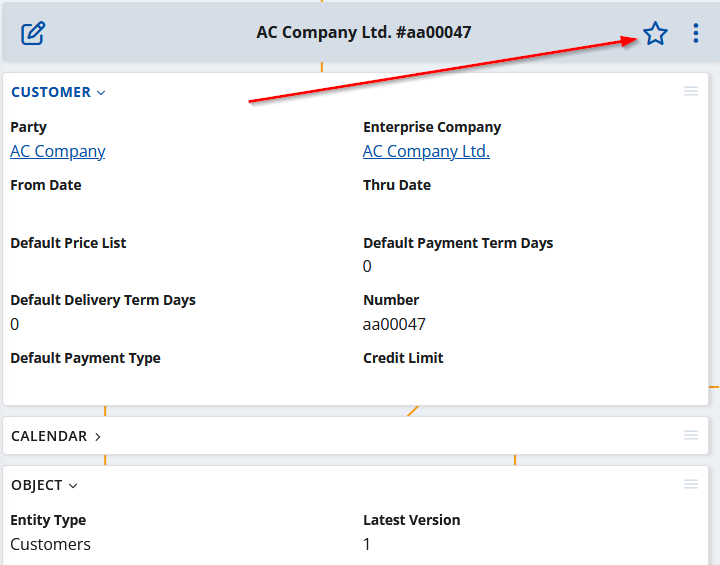
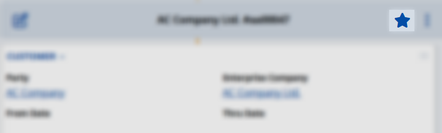

# Overview

Social follows is a key aspect in Social ERP.

The act of 'following' an object is akin to subscribing to updates for that specific item. In essence, it signifies that you want to know when something happens within its context, making it one of your 'favorite' objects. As a result of following, you'll receive individual notifications related to this object. Furthermore, this action automatically triggers the creation of a new tile within the [My Favorites](../my-apps/favorites/index.md) app. This tile visually displays the count of new notifications relevant to the object you're following. Importantly, the tile remains present as long as you continue following the corresponding object.

Adding an object to your favorites (i.e., following it) can happen in two ways: either by doing it manually or having it done automatically.

## (Un)follow an object manually

Just as the name implies, this process is manual. To achieve it, open the object you wish to follow and click on the star icon located at the upper right corner of the form.

When the star icon is filled, it means the object is already in your favorites. To unfollow it, simply click the star icon again.

")

## Auto object follow

Automatically following an object is also an option. For instance, if you're mentioned in a discussion about an object you haven't followed yet, it will be automatically added to your favorites. When this occurs, along with the new 'object follow,' you'll receive a notification specifying who mentioned you. You can find further details in the [Chatter mentions](./chatter/index.md#user-mention).

## My apps - Favorites

[!include[favorites](../my-apps/favorites/favorites.md)]