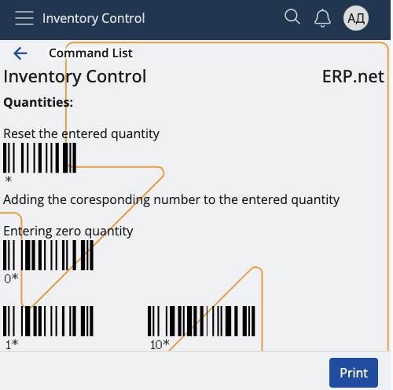
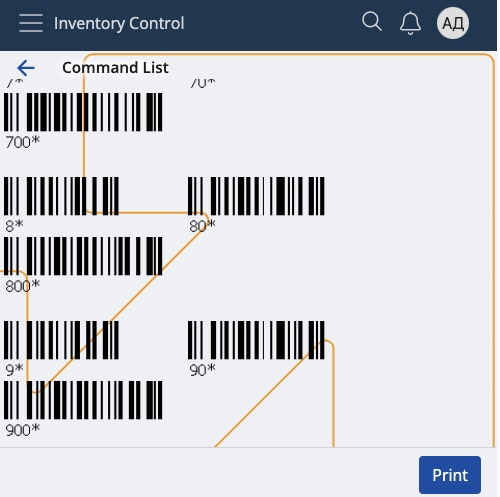
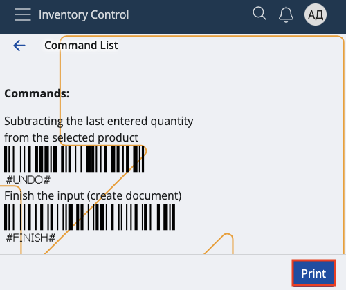

# Command list

Here, you can find various **barcodes** which help you add quantities and apply different commands automatically.

This can be handy for adding multiple instances of a product or performing certain operations like creating a document.

All available barcodes are grouped into **Quantities** and **Commands**, and each group has a short introductory description.

While quantity barcodes immediately scan a fixed amount of **instances** of a product, commands execute specific **operations**.

At any time, you can get this sheet externally by clicking the **Print** button.

