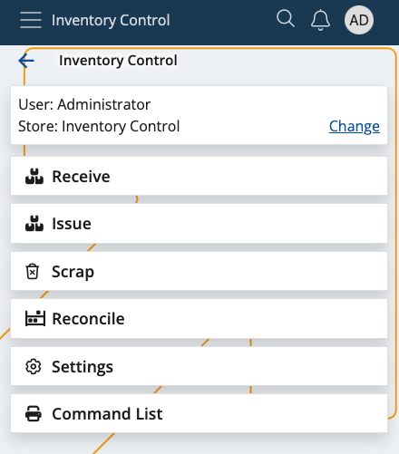

In progress.

# Introduction

Inventory Control is a warehouse management application with a contemporary and intuitive easy to use design. It allows warehouse workers to complete their tasks quickly, without going through the complex procedures required by the WMS module. 

You can receive, issue, scrap and reconcile orders in just a few steps. These actions are not synchronized in real-time with the ERP.net system.

