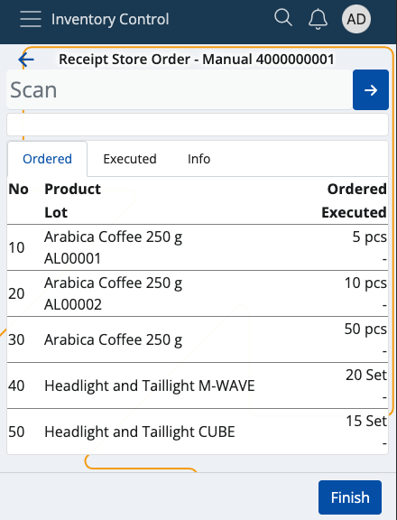
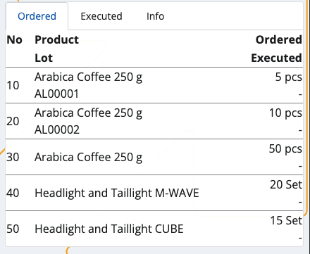
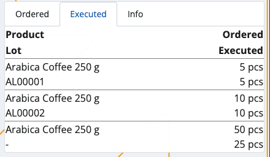
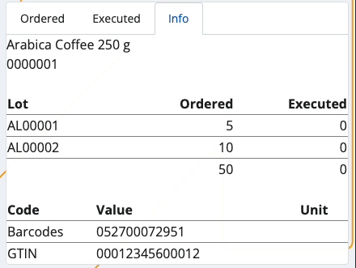
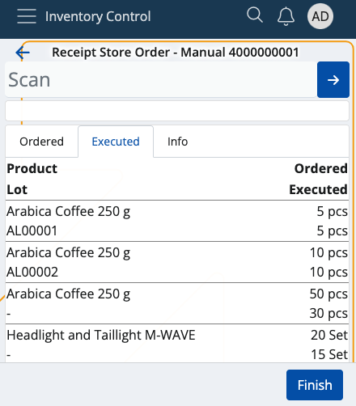
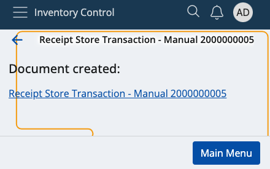
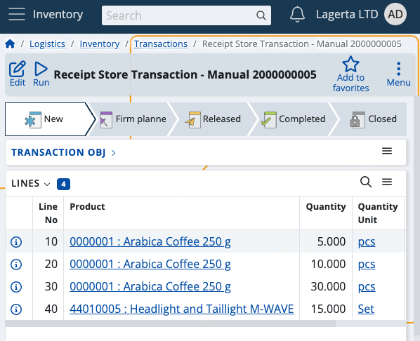

# Receive

This section allows you to **confirm** product quantities received by your warehouse or shop's store, and generate receipt store documents.

### Prerequisites

You'll be prompted to select the order document for which you want to confirm ordered product quantities.

When you tap on one, you'll be taken to the **Receive** module.

## Overview

Receieve is composed of three tabs:

* **Ordered**
* **Executed**
* **Info**

### Ordered

This is where all of your ordered product quantities are listed, together with their lots and product lines, if present.

### Executed

Here, you can find how many quantities of the products are confirmed as received as opposed to being **ordered**.

For example, out of 30 ordered pcs, only 15 may be received. This will be reflected in the receipt store document.

### Info

If you tap on a product from the **Ordered** tab, you'll be shown further information about it here.

This includes revealing its unique ID, barcode and GTIN, if present, as well as how many instances of it will be executed.

If more lots are present, the **available-scrap** ratio will be distributed based on the FEFO (first expire - first out) principle.

For example, 250 product quantities may be distributed across 3 lots with 100, 80 and 70 each. 

The lot with quantities whose date is closest to its expiration point will be prioritised in the execution process.

## Scanning

In order to execute ordered quantities, you need to use the **Scan** field.

It lets you quickly insert the instances of a product you want to confirm as received either manually or through barcode commands.

### Individual execution

Simply type in a product's ID once (e.g. "0000001") in order to receive only one pcs of it. Tap the **blue arrow** to confirm.

Every time you scan, you'll be taken to the **Info** tab for the respective product. Successfully executed pcs are painted in **green**.

If more lots are present for a product, the FEFO principle determines which lot has pcs received first.

### Multiple executions

To execute more pcs or the exact number of pcs for a product, specify it first (e.g. "50"), add a "*", and then provide the product ID.

This can be done on one line (e.g. 50*1001150), or on two separate lines for each input. Tap the **blue arrow** to confirm.

**NOTE!**

1. The **trash bin button** allows you to remove the latest execution, which will restore the previous Executed value.

2. Any one, two or three-number combination is automatically counted as a **multiplier**. You can insert it without adding "*" in the end.

### Higher count

The received pcs of a product **can** be more than what is ordered.

### Zero count

In case you've made a mistake and want to start the execution process from scratch, type in "0*" followed by the affected product ID.

If the **Executed** bar is left with zero, this will be interpreted as the product having received "0 pcs" in the final receipt store document.

## Generate a receipt order document

Once you're done executing the desired product quantities, you can go back to the **Executed** tab to see if you've made any mistakes.

The **Ordered** value will be positioned above the **Executed** one, making it easy to compare these values.

Tap the blue **Finish** button to generate your receipt store document.

This will take you to a separate space with direct access to the document template for this operation.

By tapping on it, you'll access the **Inventory** module from where you can release and complete the document.

