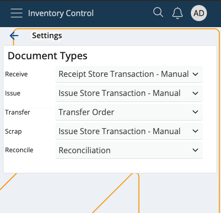

# Settings

This section lets you decide what kind of **document** will be generated following each of these actions:

* **Receive**
* **Issue**
* **Transfer**
* **Scrap**
* **Reconcile**

In order to access Inventory Control Settings, tap on the **three-dot button** at the bottom of the screen and select **Settings**.

It's crucial to link the right template to its respective action **before** beginning to do anything within Inventory Control.

If you tap on the **downward arrows** of any of the available options, you'll be taken to a list of your existing document templates.

It's possible to link any template to either the receive, issue, scrap or reconcile operation. 

One and the same template can be used for **multiple** operations.

