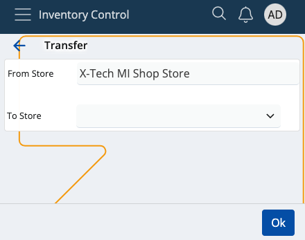

# Transfer

This section allows you to **transfer** available product quantities from one of your stores to another, and generate transfer order documents.

Transfering is useful when a particular store no longer needs certain quantities and has requested to move them to a different one.

Upon every transfer, the sending store must issue a separate **issue order** to reflect the transferred quantities, while the recipient store must issue a **receive order**. Both documents can be generated through **Inventory Control**.

### Prerequisites

You'll be prompted to select the correct store **from** which you want to transfer, and the store **to** which you want to transfer.

When done, tap **Ok**. You'll be taken to the **Transfer** module.

## Overview

Transfer is composed of three tabs:

* **Availability**
* **Transfer**
* **Info**

### Availability

This is where all of your store products are listed, together with their current quantities and lots, if present.

### Transfer

Here, you can find how many quantities of the products are selected for **transfer** as opposed to being **available** in total.

For example, out of 30pcs, only 15 may be transferred. This will be reflected in the issue store document.

### Info

If you tap on a product from the **Availability** tab, you'll be shown further information about it here.

This includes revealing its unique ID, barcode and GTIN, if present, as well as how many instances of it will be transferred.

If more lots are present, the **available-transfer** ratio will be distributed based on the FEFO principle.

## Scanning

In order to transfer currently available quantities of your products, you need to use the **Scan** field.

It lets you quickly insert the instances of a product you want to transfer either manually or through barcode commands.

### Individual transfer

Simply type in a product's ID once (e.g. "0000001") in order to transfer only one pcs of it. Tap the **blue arrow** to confirm.

Every time you scan, you'll be taken to the **Info** tab for the respective product. Successfully transferred pcs are painted in **green**.

If more lots are present for a product, the FEFO principle determines which lot has pcs transferred first.

### Multiple transfers

To transfer more pcs or the exact number of pcs for a product, specify it first (e.g. "50"), add a "*", and then provide the product ID.

This can be done on one line (e.g. 50*1001150), or on two separate lines for each input. Tap the **blue arrow** to confirm.

**NOTE!**

1. The **trash bin button** allows you to remove the latest transfer, which will restore the previous Transfer value.

2. Any one, two or three-number combination is automatically counted as a **multiplier**. You can insert it without adding "*" in the end.

3. The desired transferred pcs of a product **cannot** be more than what is set as available in the system.

### Zero count

In case you've made a mistake and want to start the transfer process from scratch, type in "0*" followed by the affected product ID.

If the **Transfer** bar is left with zero, this will be interpreted as the product having "0 pcs" for transfer in the final store order document.

## Generate a transfer order document

Once you're done transferring the desired product quantities, you can go back to the **Transfer** tab to see if you've made any mistakes.

The **Available** value will be positioned above the **Transfer** one, making it easy to these values.

Tap the blue **Finish** button to generate your transfer order document.

This will take you to a separate space with direct access to the document template for this operation.

By tapping on it, you'll access the **Inventory** module from where you can release and complete the document.

