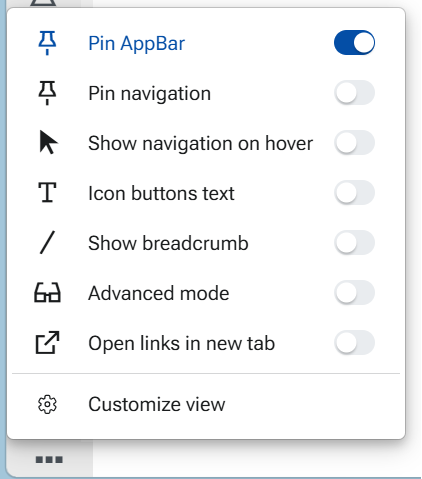

# Configurations 

This section explains the necesssary steps in order to be able to operate with layouts in @@webclient.

## 1. How to enable Layout administration permissions

To manage layout permissions a system admin should use the settings from within the Desktop client of the instance:

**Make a user a "Global Layout Manager"**

1. Go to **Setup → Security → System Security Permissions**
2. Under **General->Layout**, click on **Global Layout Manager**
3. Add group of users that should have full layout customization access.

**Make a user a "Is Layout Admin"**

1. Go to **Setup → Security → Roles- Users**
2. In the navigator choose the combination *user : role* that should have restricted layout customization access and tick the box.

---

## 2. How to get access to Panel menu and Customize panel option

The Panel menu (three small vertical dots) is merged with the Form menu (three large vertical dots). When only one panel is displayed in the form, the Panel menu is not visible.
When several panels are displayed, the Panel menus become visible only when Advanced mode is enabled.

To turn on Advanced mode:

1. Go to the **App Bar**.
2. Select the **More options** (three dots) menu.
3. Toggle **Advanced mode** to **On**.

In both cases, the panel menu is available from the Active panel section in the Form menu.

### 3. Default App-bar settings for new users

For new users (first login in a database or on a new device), the following App-bar settings are applied by default. These defaults are chosen to provide a clean and distraction-free starting interface for new users. Additional controls and navigation options can be enabled as needed, allowing each user to gradually adapt the interface to their preferred way of working - a “clean by default, power when needed” philosophy:

- **Pin AppBar** — On  
- **Pin navigation** — Off  
- **Show navigation on hover** — Off  
- **Icon buttons text** — Off  
- **Show breadcrumb** — Off  
- **Advanced mode** — Off
- **Open links in new tab** - Off

