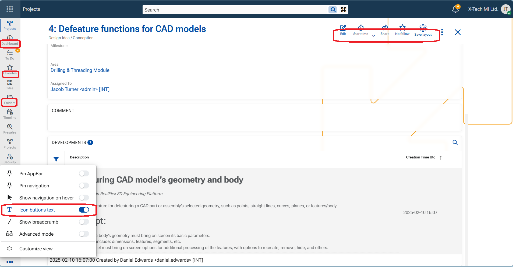
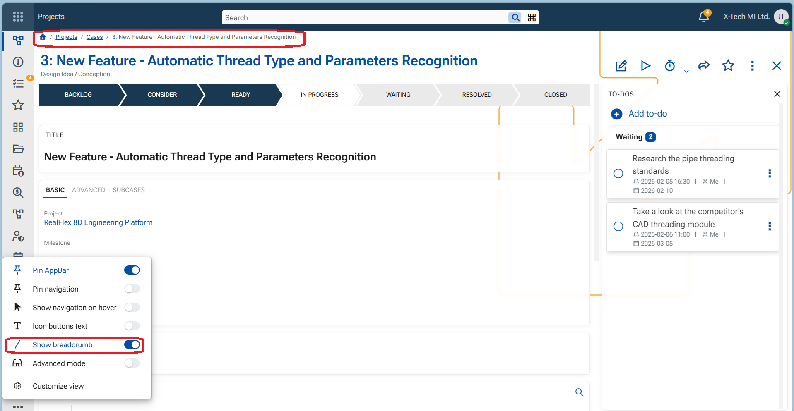

# App-bar menu options

The App-bar menu lets users control the visibility and behavior of key interface elements—such as navigation, breadcrumbs, button titles, and Advanced mode—so the Web Client adapts to their preferred way of working. These settings are stored per user, and each option can be switched **On or Off**.

Explanation of the menu options

**1. Pin AppBar**
- When On, the App-bar is pinned to the screen and always visible.
- When Off, the App-bar is hidden to provide a larger working area and can be accessed from the Start button in the top-left corner.

**2. Pin navigation**
- When On, the navigation panel is pinned to the screen and always visible.
- When Off, the navigation panel opens only after the user clicks an item in the App-bar.

> [!IMPORTANT]
> App-bar should be pinned in order to pin the navigation too.

**3. Show navigation on hover**
- When On, the navigation panel opens when you hover over an App-bar item.
- This is useful if you want quick access to navigation without keeping the panel permanently visible.

**4. Icon buttons text**
- When On, text labels are shown for buttons and modules.
- When Off, only icons are displayed, reducing text density and visual noise while keeping actions easily recognizable.

**5. Show breadcrumb**
- When On, the breadcrumb path to the current object or record is displayed at the top-right of the central panel.

**6. Advanced mode**
- When On, additional UI controls become available.
- When Off, these controls are hidden to keep the interface cleaner.

Advanced mode affects the visibility of: Panel menu, Maximize button, Filter funnels in grids, Panel collapse chevron

**7. Customize view  **
Opens a settings panel that allows the user to choose which applications are displayed on the App-bar and to define their order. This lets each user personalize quick access to the applications they use most.

