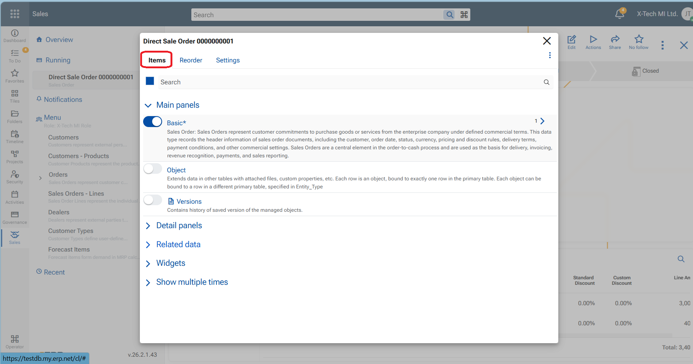
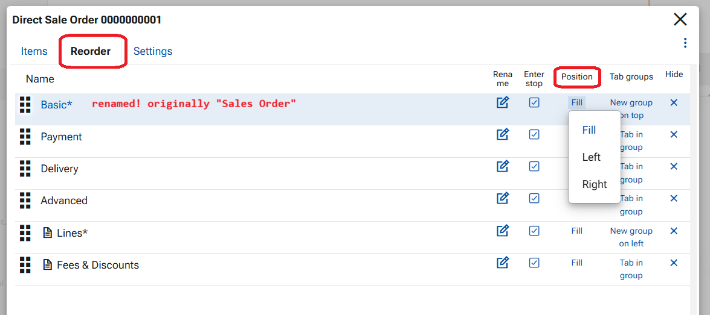
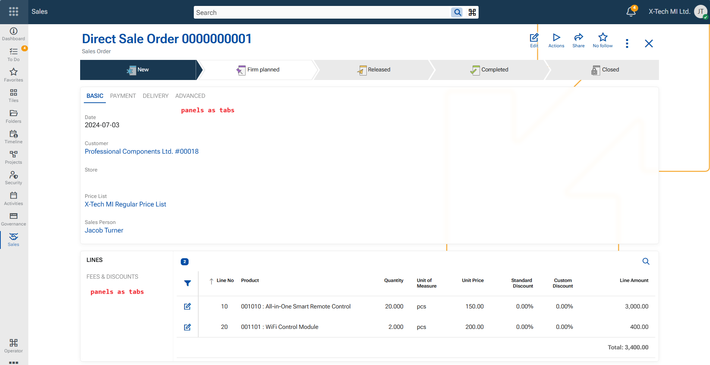

# How to customize form in @@webclient

A Form is the topmost core UI component in the Web Client. It represents a single page and displays data through a structured, user-friendly interface composed of multiple panels. A form can function as the home page of a module, where different sections are shown, or as a single-record form, which presents all main, related, and detailed data for one record.

Form customization allows users to personalize which panels are displayed on a form and how they are arranged.

To start customizing a form, open the **Form menu** (three large vertical dots) and select **Customize form**. A settings screen opens on top of the form with three tabs: **Items**, **Reorder**, and **Settings**.

## Items tab

The **Items** tab defines **which panels are available in the form**.

From this tab, you can enable or disable:
- Main panels  
- Detail panels  
- Related data panels  
- Widgets  
- Tiles  
- Multiple instances of the Main panel  

Only panels enabled here can be arranged and displayed in the form.

---

## Reorder tab

The **Reorder** tab controls **how panels are arranged within the form**.

You can:
- Reorder panels using drag and drop  
- Rename panels  
- Hide panels  
- Define panel **Position**  
- Group panels as **Tabs**

### Panel position

The **Position** option defines where a panel appears in the form:
- **Fill** – occupies the main content area (most commonly used)  
- **Left** – displayed on the left side of the form  
- **Right** – displayed on the right side of the form  

### Grouping Panels into Tabs

Panels can be grouped into tabs within a host panel using the **Tab groups** option.

A new tab group can be created in one of four directions:
- New group on top  
- New group on right  
- New group on left  
- New group on bottom  

1. Choose the panel that will act as the **host panel**.  
2. Set its option to **New group** in the desired direction.  
3. For each panel that should appear inside this group, set its option to **Tab**.

Panels marked as **Tab** are displayed as tabs within the host panel.

---

## Form Settings

The **Settings** tab contains global behavior options for the form. Currently available is config option- **Always save on close** – when enabled, all changes made in a record are automatically saved when the button X Cloes is pressed.

> [! IMPORTANT]
>  When finished, close the customization screen using the X button.
> Click the red Save layout button in the top ribbon to save the changes persistently.

An example of a customized single-record form:

