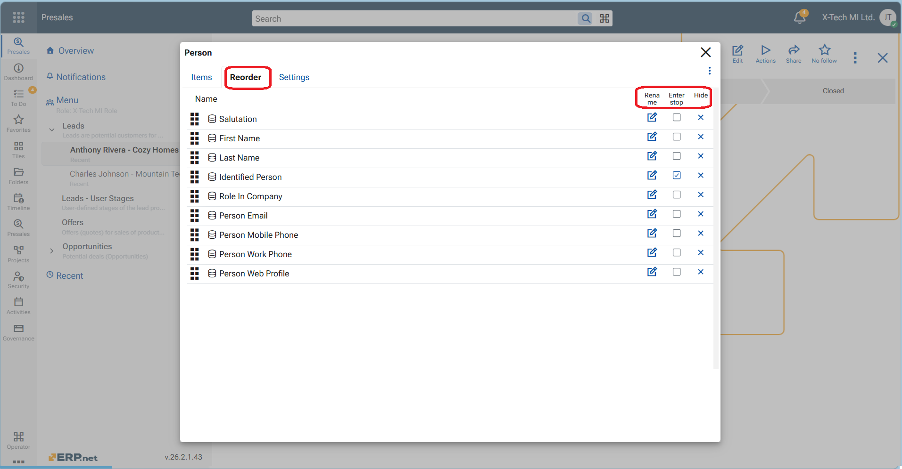

# How to customize a main panel in @@webclient

The Main panel contains the fields that define a single record for a given entity type. It represents the core data of the record and is used both when creating and viewing records. The [Customize panel option](https://docs.erp.net/webclient/layouts-and-views/configurations.html#2-how-to-get-access-to-panel-menu-and-customize-panel-option) for the Main panel is accessed from the panel menu (the three-dot menu in the panel header), 

Customizing the Main panel allows you to control how record data is presented on screen. You can:

- Show or hide fields
- Rename field labels
- Change the order of fields
- Set label position (top or left of the field)
- Show or hide field descriptions
- Define the panel height (number of visible rows)
- Choose the number of columns in which fields are arranged

These options let you tailor the Main panel to display only the most relevant information, reduce visual clutter, and optimize the layout for different working scenarios.

**Steps**

Follow these steps to customize the fields and layout of a panel:

1. From the **Panel menu**, select **Customize panel**.
2. In the **Items** tab, turn on the toggles next to the fields you want to display in the panel.
3. In the **Reorder** tab, drag and drop fields vertically to arrange them in the desired order.
4. From the same tab, you can also **rename**, **hide**, or define an **enter stop** for individual fields.
5. In the **Settings** tab, configure the panel layout by choosing:
   - Panel height  
   - Label position  
   - Field description visibility  
   - Number of columns for the fields
6. When finished, close the customization screen using the **X** button.
7. Click the red **Save layout** button in the top ribbon to save the changes persistently.

