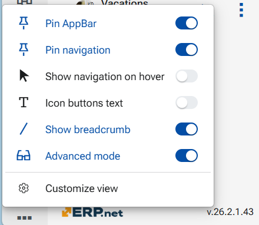

# Interface, Layouts and Views in @@webclient

The @@webclient is designed around flexible layouts and views that help users work efficiently with data, regardless of role or device.

## Instance interface 

The @@webclient platform initially loads with its default preset appearance, including theme, background, text density, and language. Users can customize this appearance using the personalization options available in the profile menu. The menu can be accessed by clicking the user avatar.

You can distinguish several key building elements - top ribbon, menu ribbon, app-bar, navigation panel, central panel and side panel.

## Layouts

A **layout** defines how the interface elements are arranged within a view. It refers to the arrangement and organization of the positioning of fields, panels, tabs, and related data sections, gateways to modules and applications too. Filters in Advanced filter panel also affect the layout.

### 1. Key characteristics of layouts

- Responsive design – automatically adapts to desktop, tablet, and mobile screens
- Logical grouping – related fields are organized into sections and tabs
- Consistency – similar documents follow similar layouts, reducing learning time

Layouts are optimized to minimize scrolling, highlight important fields, improve data entry speed and accuracy

### 2. Layout Behavior and Flexibility

- Responsive Layouts: The web client adjusts layouts to screen size (desktop vs. tablet), but specific responsive behavior is not deeply detailed in documentation.
- Panel-based design: All layouts are panel-driven, and user roles can control what appears where.

### 3. The Panel - the main component 

🧱 Panels - The main visual elements used to present data and actions:

- Form panels – for editing or viewing a single business object
- Line/row panels – for displaying multiple records (navigators panels)
- Report panels – for generating and viewing reports (Reports and Ledgers)
- Web view panels – for embedding custom HTML content
- Dashboard panels – user-configurable pages combining multiple widgets
- Side panels - context driven supportive data panels, placed to the right of the central data panel
- Navigation panel - holds the gates to entities and records
- App-bar - home of active modules and applications

---

## Views

A view defines what data is displayed and how it is presented. Views are optimized for different tasks and user needs.

Common view types in @@webclient include:
- Grid/table/list view - Displays records in a structured table format. Ideal for browsing, filtering, sorting, and comparing large sets of data.Usually within a navogator panel and row-panel

- Pivot view - represent data ready for analysis

- Kanban view -

- Detail View - Shows all available information for a single record. Used for reviewing, editing, or completing documents and master data (main panel of a definition).

- Tree / Hierarchical View - Visualizes parent–child relationships, such as product categories or organizational structures (document route panel, case hierarchy panel)

---

## Layout personalization and usability

The Web Client allows a high degree of customization. This ensures a clean, task-focused interface that improves productivity and reduces cognitive load. Users with configuration access can:

- Adopt a ready-made layout for a new document type
- Rearrange panels
- Add/remove panels 
- Move panels into different tabs
- Show/hide fields
- Adjust panel height
- Show/hide elements - fields, modules, applications, titles and descriptions
- Shoq/hide key components - definitions, reports, setup forms
- Save changes to personalize the layout
- Users can adjust column visibility and order in list views
- Filters and preferences can be saved per user
- Frequently used views can be accessed quickly

The option for all these abilities is called "Customize form / Customize panel" and Settings, indicated by a "gearwheel" icon.

## The App-bar menu

A significant role in the customization plays the App-bar menu. It allows you to control how the Web Client interface behaves and what UI elements are visible on the screen.
From here, you can adjust the visibility and behavior of the navigation panel, enable or hide contextual elements such as breadcrumbs and button titles, and switch between a simplified and an advanced interface using Advanced mode. These settings let each user tailor the interface to their working style—balancing clarity, screen space, and access to advanced controls.

