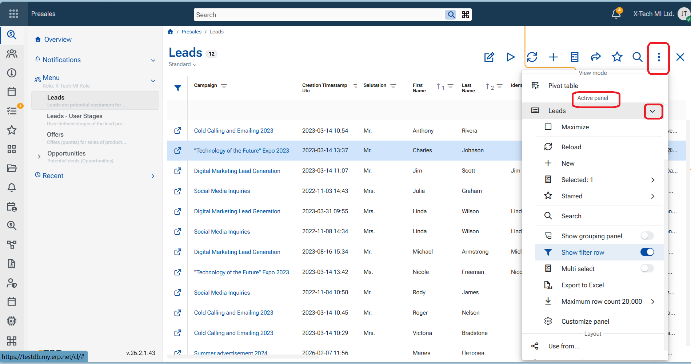

# Customize navigator panel

The navigator layout defines which fields are visible and how they are arranged in a navigator. You can customize the layout to better match your working preferences.

## Enable Advanced Mode

Managing navigator layouts requires **Advanced mode** to be enabled.

To turn on Advanced mode:

1. Go to the **App Bar**.
2. Select the **More options** (three dots) menu.
3. Toggle **Advanced mode** to **On**.

## Customize 

To customize a navigator’s layout:

1. Make sure the **navigator** you want to customize is the **active panel** - click inside it
2. Go to the  top ribbon and click **Menu**.
3. Navigate to section **Active Panel**.
4. Click the **name of the currently active navigator**.
5. Select **Customize panel** from the listed options.

A **Customize Panel** window opens and overlays the current navigator.

## Adjust Layout Settings

In the Customize panel window, you can:
- Show or hide fields (columns)
- Change the order of fields
-  Adjust the height of the panel or freeze a number of columns to the left

When you close the Customize panel window with X, the changes are reflected immediately in the navigator.

## Save major layout changes

Any change made through the Customize view panel is considered a major change. To keep the customized layout for the current role and layout for future use:

1. Go to the **top section of the current screen**.
2. From the available controls, select the **Save Layout** button, that is red in colour.

This action updates and saves the current navigator layout persistently.

## Save minor layout changes

A minor change is considered any change outside Customize panel option eg. column width, sorting, hiding a column, grouping etc. In such case the Save layout button is blue.

> [!Note] 
> Saved layouts apply to the current role and layout configuration.
