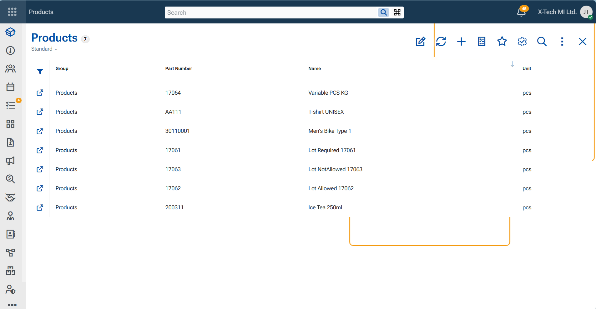
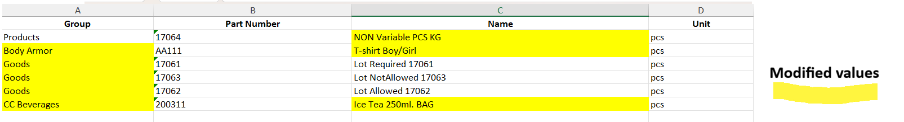
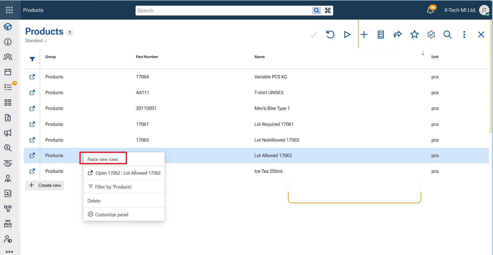
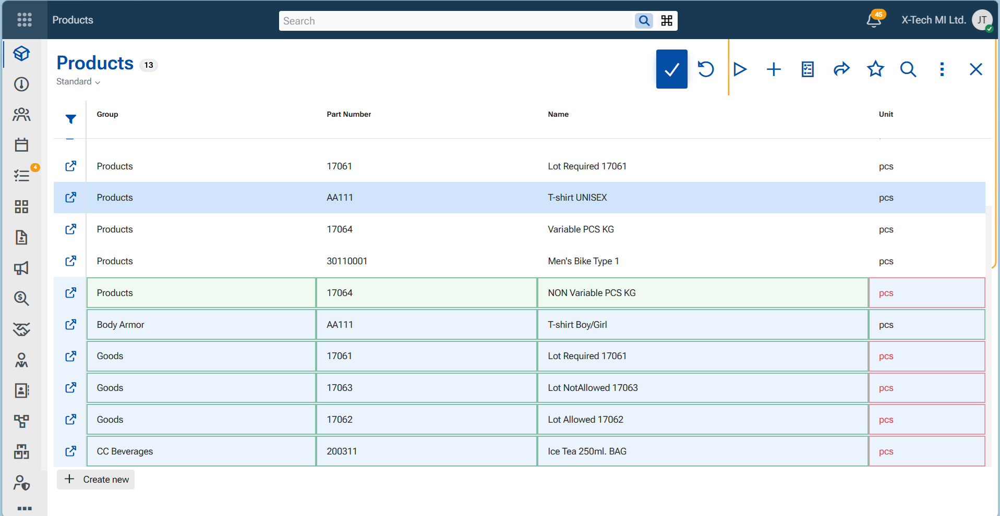
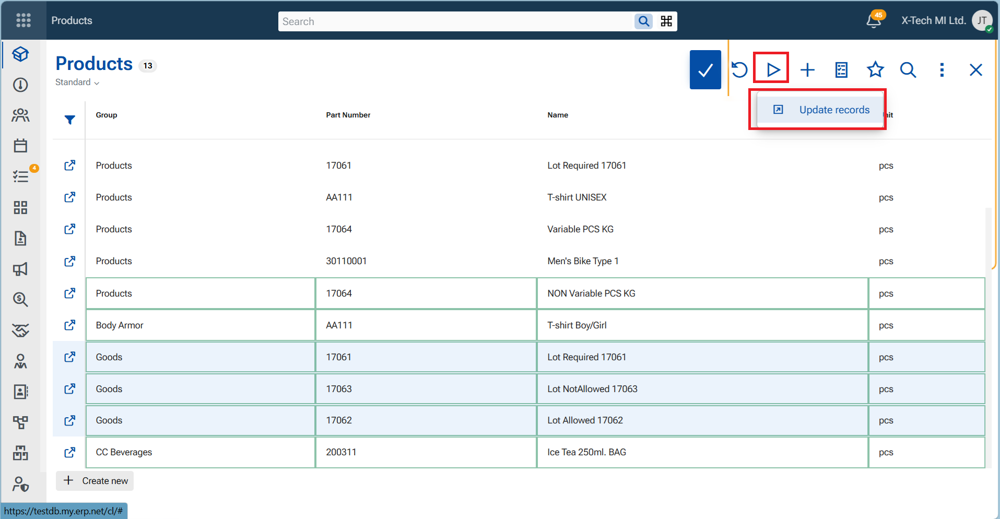
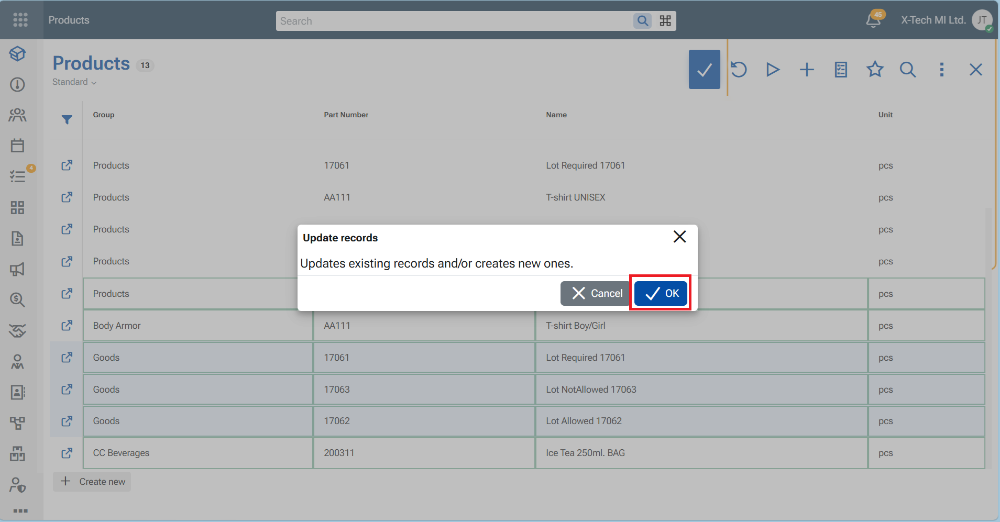
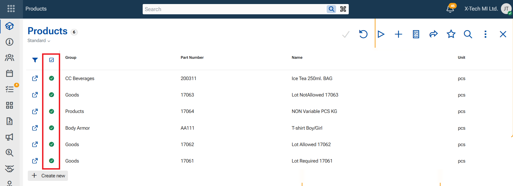

# Update records

The "Update records" function allows you to apply changes to multiple records directly from the navigator. Instead of editing existing records one by one, you can prepare or paste updated data into the navigator and apply all changes with a single command.
It is equal to function "Merge" in WinClient.

During the operation, the system matches the prepared rows with existing records using the entity's primary key. If a matching record is found, it is updated with the new values. If no matching record exists, a new record is created automatically.

> [!Important]
> Changes made by the Update records function are applied and saved immediately. Unlike normal editing in the navigator, the operation commits all successfully processed records directly to the database.

> [!Note]
> The Update function is intended for mass updates. Unlike Save, which stores the current state of edited records, Update treats the pasted rows as the source
of an update operation. Existing records are matched by their primary key and updated accordingly, reducing the risk of creating duplicate records during bulk
data modifications.

## Prerequisite

Before running "Update records", make sure the navigator displays all columns whose values you want to update.

The Update function only processes the columns that are currently visible in the navigator. Hidden columns are ignored, even if they are present in the pasted data. If you want to update a particular field, display its corresponding column before executing the operation.

# Steps

In this example, we will update several existing products by copying modified data from an Excel spreadsheet into the Products navigator.

**1.** Open the Products navigator and display the columns that you want to update.

💡 Tip

Only the columns that are visible in the navigator participate in the update operation. Hidden columns are ignored.

**2.** Prepare the data to be updated in an external source, such as an Excel spreadsheet.

Arrange the columns in the same order as the corresponding columns in the navigator and modify the values that you want to apply to the existing product records.

**3.** Copy the prepared rows.

**4.** Switch the navigator to Edit mode.

**5.** Right-click anywhere in the navigator and select "Paste new rows".

The copied rows are pasted into the navigator.

6. If any pasted cells are highlighted in red, correct the invalid values directly in the navigator by selecting valid values from the available lists.

When all validation errors have been resolved, the pasted cells are outlined with green borders, indicating that the rows are ready to be processed.

7. From the ribbon, click "Action" and then select "Update records".

 

8. In the confirmation dialog, click OK to start the operation.

The system compares the pasted rows with the existing records using the entity's primary key. Records with matching primary key values are updated with the new data. If no matching record is found, a new record is created.

10. When the operation completes, review the results.

The navigator is refreshed to display the processed records. Successfully updated or created records are marked with a green status indicator. If a row is marked with a red status indicator, the operation for that row was not completed successfully and requires your attention.

 
