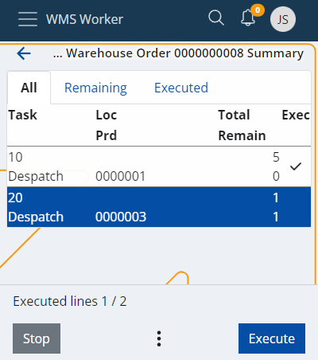
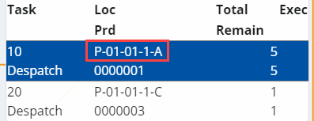

# Picking routing
Workers who physically pick items for the warehouse orders use picking routes to guide them trough the process.
The route is calculated using the “Suggest warehouse locations” function that is available in the Orders menu of WMS worker. The picking route takes into account the different parameters that are set up for the warehouse, such as:
- The Zones specified as picking zones through the Zone Type policy;
- The Locations addresses that are used to calculate the best route through the warehouse.
as well as other factors, such as:
-the availability in different locations – suggests the location with the smallest availability that is enough to fulfill the order
- the lot’s Expiry Date

> [!NOTE]
> The Pick task type is not yet supported by the system. Instead, a Dispatch task type is used, which directly issues the product from the Warehousе.

Currently the function can only be used for dispatch Warehouse Orders i.e. Warehouse Orders whose lines are only with Dispatch or Comp-dispatch task type.

## How to use it?

Open the **Orders** menu of WMS Worker.

 
This takes you to a list of the orders that are available for execution for the current worker.
Click on the outbound order you would like to execute.

 
At the bottom of the screen, you will find a three-dot button, from which you can access the **Suggest Warehouse Locations** function:

This immediately starts the calculation of the function.

When the calculation is done, the function will load all Locations that were sucessfully determined in the **Loc** column and will automatically sort the lines ascending by the location's address. 

This  will form the route that the worker needs to follow to sequentially collect all products from the order.

You can start following the route by by clicking the **Execute** button. This will diplay the first screen which contains the information about the suggested Location and will lead the worker to it.

When the worker reaches the Location, he has to scan the Location and perform the rest of the line the execution as usual. 
Once the execution of the first line is finished, the 

 
